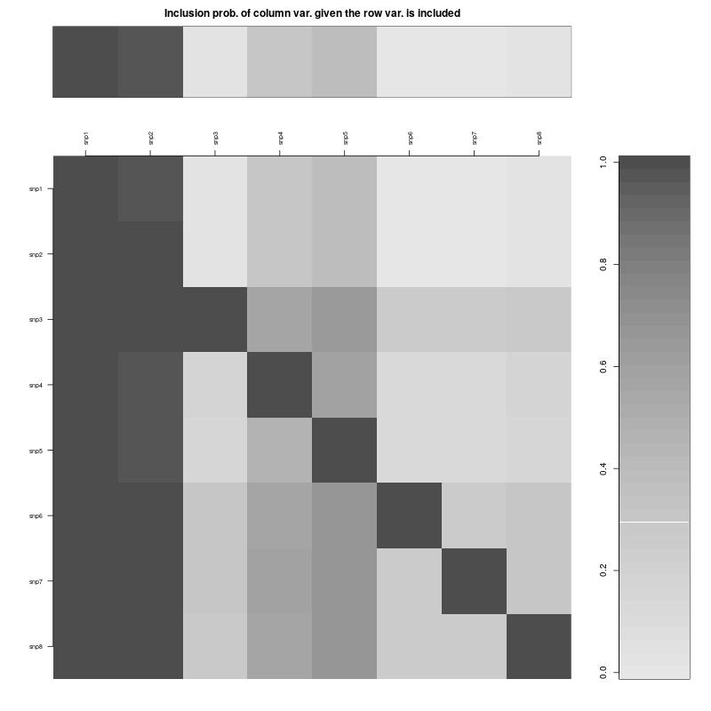
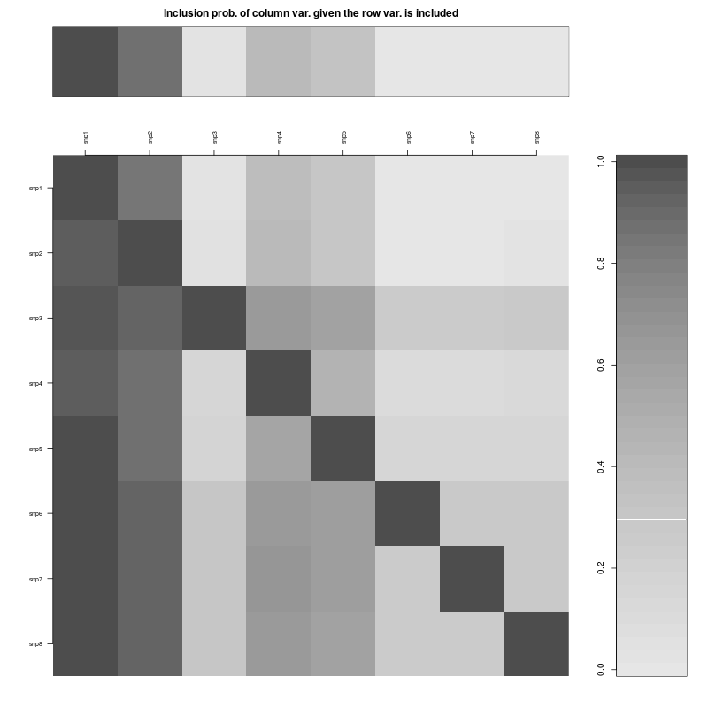

\small

```{r setup, include=FALSE}
knitr::opts_chunk$set(
collapse = TRUE,
comment = '#>',
fig.path = './figures/'
)
knitr::knit_engines$set(julia = JuliaCall::eng_juliacall)
options(JULIA_HOME = '/home/dreth/julia/bin')
```

```{r, echo=FALSE, warning=FALSE, message=FALSE}
library(dplyr)
library(stringr)
library(BayesVarSel)
library(ggplot2)
```

```{r, echo=FALSE, warning=FALSE, message=FALSE, results='hide', eval=TRUE}
# Reading the data for the factor model
gen <- read.csv("gendata.csv",header = TRUE,sep=";",row.names = 1)

# Making all the predictors factors
for (i in 1:(length(names))) {gen[,i] <- as.factor(gen[,i])}

# Transforming the response using log 
gen$conc <- log(as.numeric(gen$conc))

# generating the factor model
factor_model <- Bvs(formula= conc ~ ., data=gen, prior.betas = "Robust")

# Reading the data for the numeric model
gen <- read.csv("gendata.csv",header = TRUE,sep=";",row.names = 1)

# Making all the predictors numeric
for (i in 1:(length(names))) {gen[,i] <- as.numeric(gen[,i])}

# Transforming the response using log 
gen$conc <- log(gen$conc)

# generating the factor model
numeric_model <- Bvs(formula= conc ~ ., data=gen, prior.betas = "Robust")
```

## Introduction

The objective of this research is to obtain the best model to predict concentration of protein in blood utilizing genetic SNP data from 100 individuals.

## Model

We will study the best possible model, first taking into account that our variables are factors. Then we will attempt to obtain the best possible model considering the variable as factors and then as numeric values. The linear models would be as follows (if we only had a variable with 3 levels):

- Model where predictors are factors:

$$y = \beta_0 + \beta_1 * \text{level1 } + \beta_2 * \text{level2}$$

$\beta_0$ being the value when the factor has the value of the first level.

*level1* and *level2* are the remaining 2 levels of the first variable.

- Model where predictors are factors:

$$y = \beta_0 + \beta_1 * \text{Var1}$$

To know what the best models are, we use a Robust prior, this is a prior of the form:

$$\begin{split} \pi_i^{R} (\beta_0, \beta_i, \sigma) & = \pi(\beta_0, \sigma) \times \pi_i^{R} (\beta_i | \beta_0, \sigma) \\
& = \sigma^{-1} \times \int_0^{\infty} \nu_{k_i} (\beta_i | 0, \prescript{}{g}{\Sigma}_{i}) p_i^{R} (g) dg \end{split}$$

We have chosen this specific prior because its importance is limited. Given a scenario where we have a conflict between the data and the prior, a robust prior gives us significant flexibility when attempting to solve this conflict by attributing more importance to the data. 

# Results

Models which use predictors of factor type tend to explain better than numeric types models. The reason for this is the fact that the distance between the different values of the genetic profiles are the same. Which means that, for instance, if we use it as quantitative variable, the distance between 1-3 will be larger than 1-1.

As a result, our chosen model is our model which uses factors:

$$conc = \beta_0 + \beta_1 * \text{V1L1} + \beta_2 * \text{V1L2} + \beta_3 * \text{V2L1} + \beta_4 \text{V2L2}$$

All our plots shown in the annex show the same, the models which use variables represented as factor are stronger.

The posterior dimension probabilities of our model using factors as predictors are:

&nbsp;

```{r, echo=FALSE, warning=FALSE, message=FALSE, fig.width = 8, fig.height = 4}
plot(factor_model, option="dimension")
```

\newpage

# Annex: Code and plots

```{r, echo=TRUE, warning=FALSE, message=FALSE, results='hide', eval=FALSE, fig.show='hide'}
# Reading the data for the factor model
gen <- read.csv("gendata.csv",header = TRUE,sep=";",row.names = 1)

# Making all the predictors factors
for (i in 1:(length(names))) {gen[,i] <- as.factor(gen[,i])}

# Transforming the response using log 
gen$conc <- log(as.numeric(gen$conc))

# generating the factor model
factor_model <- Bvs(formula= conc ~ ., data=gen, prior.betas = "Robust")

# Reading the data for the numeric model
gen <- read.csv("gendata.csv",header = TRUE,sep=";",row.names = 1)

# Making all the predictors numeric
for (i in 1:(length(names))) {gen[,i] <- as.numeric(gen[,i])}

# Transforming the response using log 
gen$conc <- log(gen$conc)

# generating the factor model
numeric_model <- Bvs(formula= conc ~ ., data=gen, prior.betas = "Robust")

# Plotting histogram for factor and numeric model + heatmap for probabilities
plot(factor_model, option="dimension")
plot(numeric_model, option="dimension")
plot(factor_model, option="dimension")
plot(numeric_model, option="dimension")
```

\newpage

# Plots

## Heatmaps for model probability

{width=45%}

{width=45%}